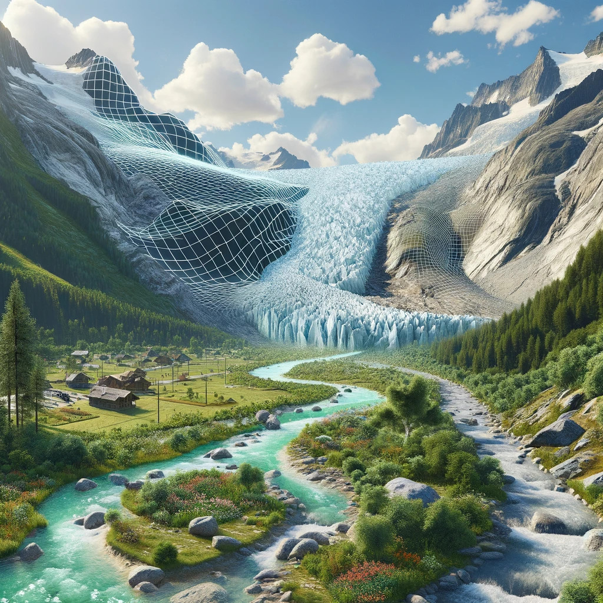

::::{grid} 2
:reverse:

:::{grid-item}
:columns: 4
:class: sd-m-auto



:::

:::{grid-item}
:columns: 8
:class: sd-fs-1
A Digital Twin Component for Glaciers
:::

::::

The **DTC-Glaciers project** is part of the European Space Agency’s **Digital Twin Earth (DTE)** initiative, developed under ESA's **Digital Twin Components (DTC) "Early" Development Actions**.

Using Earth observation data, in-situ measurements, and advanced modeling techniques, DTC-Glaciers aims to create an interactive digital representation of mountain glaciers over the past two decades. This open and interactive platform will enable users and stakeholders to explore and understand the rapid transformations of mountain glaciers and their water resources.

:::{note}
This project has just started! Check back for updates soon.
:::

# <h2>Use cases</h2>

DTC-Glaciers will prototype a suite of tools and services to support the monitoring and management of mountain glaciers and their water resources. During this preliminary phase, we will focus on the following use cases:

{octicon}`graph` **Glacier runoff monitoring**: targeting glaciers in Iceland and the Austrian Alps, DTC-Glaciers will deliver daily glacier runoff estimates with unprecedented accuracy. This information is crucial for water resource management, hydropower production, and flood risk assessment.

{octicon}`people` **User interaction and feedback**: designed with stakeholders in mind, the platform will allow hydrologists, glaciologists, and water resource managers to inform the twin with new observations and recent events. This should be possible through a user-friendly interface, enabling the platform to learn and improve over time.

## Consortium

::::{grid} 1 1 2 3
:class-container: text-center
:gutter: 3

:::{grid-item-card}
:class-header: bg-light text-center
:link: https://www.bristol.ac.uk/geography
**University of Bristol**
^^^
```{image} img/logos/UoB.svg
```

+++
**Project lead**
:::

:::{grid-item-card}
:class-header: bg-light text-center
:link: https://earthwave.co.uk
**EarthWave**
^^^
```{image} img/logos/earthwave.png
:height: 100
```

+++
**EO & DESP specialist**
:::

:::{grid-item-card}
:class-header: bg-light text-center
:link: https://wgms.ch
**U. of Zürich / WGMS**
^^^
```{image} img/logos/UoZ.png
```


```{image} img/logos/wgms.png
```

+++
**Stakeholder engagement**
:::

:::{grid-item-card}
:class-header: bg-light text-center
:link: https://www.uibk.ac.at/en/acinn/
**University of Innsbruck**
^^^
```{image} img/logos/UIBK.png
```

+++
**Uncertainty quantification**
:::

:::{grid-item-card}
:class-header: bg-light text-center
:link: https://www.enveo.at
**ENVEO**
^^^
```{image} img/logos/enveo.png
```

+++
**EO specialist**
:::

:::{grid-item-card}
:class-header: bg-light text-center
:link: https://geosciences.ed.ac.uk/
**University of Edinburgh**
^^^
```{image} img/logos/UoE.png
:height: 120
```

+++
**EO specialist**
:::

::::

(contact)=
## Contact

- Project lead: [Fabien Maussion](https://fabienmaussion.info)
- Project management: [Earthwave](https://earthwave.co.uk/)
- ESA Digital Twin Earth initiative: [dte.esa.int](https://dte.esa.int)
